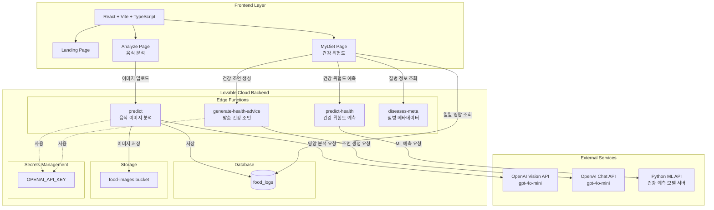

# 시스템 아키텍처

## 개요
본 프로젝트는 음식 이미지 분석 및 건강 위험도 예측을 제공하는 웹 애플리케이션입니다.

## 시스템 구성도

## 레이어별 설명

### Frontend Layer
- **기술 스택**: React, Vite, TypeScript
- **주요 페이지**:
  - Landing Page: 서비스 소개 및 메인 페이지
  - Analyze Page: 음식 이미지 업로드 및 영양 분석
  - MyDiet Page: 일일 식단 조회 및 건강 위험도 분석

### Backend Layer (Lovable Cloud)

#### Edge Functions
1. **predict**: 음식 이미지를 분석하여 영양 정보 추출
   - OpenAI Vision API 활용
   - 분석 결과를 food_logs 테이블에 저장
   
2. **predict-health**: 사용자의 건강 위험도 예측
   - Python ML API 서버와 통신
   - SHAP 값을 활용한 위험 요인 분석
   
3. **generate-health-advice**: 맞춤형 건강 조언 생성
   - OpenAI Chat API 활용
   - 위험 요인 기반 구체적인 식단 조언 제공
   
4. **diseases-meta**: 질병 메타데이터 제공

#### Database
- **food_logs**: 음식 로그 및 영양 정보 저장
  - 칼로리, 탄수화물, 단백질, 지방 등 영양소 정보
  - 위험도 및 코멘트

#### Storage
- **food-images bucket**: 업로드된 음식 이미지 저장

#### Secrets
- **OPENAI_API_KEY**: OpenAI API 인증을 위한 비밀 키

### External Services

1. **OpenAI Vision API**
   - 모델: gpt-4o-mini
   - 용도: 음식 이미지 분석 및 영양 정보 추출

2. **OpenAI Chat API**
   - 모델: gpt-4o-mini
   - 용도: 개인 맞춤형 건강 조언 생성

3. **Python ML API**
   - 엔드포인트: https://health-predict-api-585909530618.asia-northeast3.run.app
   - 용도: 머신러닝 기반 건강 위험도 예측 (당뇨병, 고혈압, 이상지질혈증, OSAS)

## 주요 데이터 플로우

### 1. 음식 분석 플로우
1. 사용자가 Analyze 페이지에서 음식 이미지 업로드
2. `predict` Edge Function이 OpenAI Vision API로 이미지 분석 요청
3. 영양 정보 추출 후 `food_logs` 테이블에 저장
4. 이미지는 `food-images` 버킷에 저장

### 2. 건강 위험도 분석 플로우
1. 사용자가 MyDiet 페이지 방문
2. `food_logs`에서 일일 영양 데이터 조회
3. `predict-health` Edge Function이 Python ML API로 위험도 예측 요청
4. 위험도 >= 0.4인 경우, `generate-health-advice`로 맞춤 조언 생성
5. OpenAI Chat API를 통해 구체적인 식단 조언 반환

## 보안

- **RLS (Row Level Security)**: food_logs 테이블에 적용
- **Secrets Management**: API 키는 Lovable Cloud의 Secrets로 안전하게 관리
- **Public Bucket**: food-images 버킷은 공개로 설정되어 이미지 접근 가능

## 확장성

- **Edge Functions**: 서버리스 아키텍처로 트래픽에 따라 자동 확장
- **Lovable Cloud**: Supabase 기반으로 수백만 사용자까지 확장 가능
- **ML API**: 독립적인 Python 서버로 분리되어 모델 업데이트 및 확장 용이
